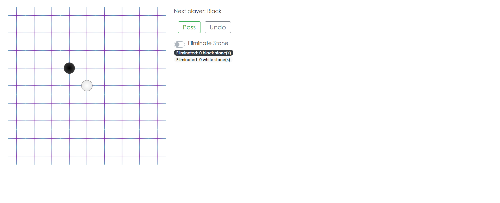

## Assignment 2 - React a Go Board

My first React app of creating a [Go game](<https://en.wikipedia.org/wiki/Go_(game)>). It is only for the board of the game, not the game itself.

Tools: **_React.js_** and **_Bootstrap_**

# View Here -> [https://elleech.github.io/infsci2560_a2-ReactGoBoard/](https://elleech.github.io/infsci2560_a2-ReactGoBoard/)

### Website Pages Preview:

### Documentation of Design Decisions

I have 3 components in total (listed from the top of the hierarchy to the bottom): game, board, intersect.

1. **intersect**: The smallest element of building the board.
   Each intersect is a button with a default background image of a beautiful purplish cross.
   And the bachground image would change if the _props_ value is modified on the _game_ level.

2. **board**: Arranges 81 intersect buttons to the grid the game desires.
   Has 2 functions inside other than `render()` - `renderIntersect()` and `createBoard()`. 
   Since it uses _intersect_, it has to import _intersect_. 

   - `renderIntersect()` - Is like a bridge that tells the _intersect_ what to do when the value and method on the _game_ level change. 
   - `createBoard()` - Simply create the grid the game needs.

3. **game**: The top level of my component hierarchy. Thus, it needs a `constructor(props)` to construct all the values.
   Every value that is used in this level is a state property.
   Has 4 functions other than `render()` inside - `handleClick(i)`, `handlePass()`, `handleUndo(step)`, and lastly `isRemoveActivated()`. 
   It only needs to import _board_. 

   - `handleClick(i)`: Defines methods for each button, either place a stone (defualt background) or remove a stone (black or white stone background). 
   - `handlePass()`: Goes to the next player. 
   - `handleUndo(step)`: Goes to the previous step. 
   - `isRemoveActivated()`: Tells `handleClick(i)` to activate removing method. 

**All components must have a `render()` function to actually make that component work.**
For example, in _game_, it renders (a) the board, (b) 2 buttons for player to pass or undo, (c) a switch that activates remove, and (d) some text information so user can play with.

---

## Assignment Instructions

The goal of this assignment is to create a functional Go board using React. This means you will create an interactive, graphical user interface using HTML, CSS, and JavaScript that allows two people to play Go in the browser. You are not required or expected to implement the logic of Go the game. Rather, you must implement the characteristics and constraints of a physical Go board with rules that enforce the rules of an actual Go board (not allowing players to place two stones on an intersection).

You should implement React components, handlers, and state that behave like a physical Go board. A physical Go board does not enforce any of the rules of the game, it merely provides a surface for placing stones at intersections. Like Go in the physical world the calculations for keeping score at the end of the game will be done by human beings.

To start, you should read about the [history](<https://en.wikipedia.org/wiki/Go_(game)>) and [rules of Go](https://www.britgo.org/intro/intro2.html). You will need to understand the rules of the game, even if you are not required to implement them. It is best to think through how the game is played on a physical board and then use that to guide the design of your virtual Go board.

Your React Go board application should have the following:

- A grid that is at least 9x9 squares. 19x19 is the standard size. You might also consider designing a variable Grid, but this is not required.
- The ability to place either a black or white stone at the intersections of the grid when the intersection is clicked.
- Some kind of turn taking so players can alternate placing black or white stones. You will also need to implement the ability to pass a turn without placing a stone.
- Some kind of mechanism for removing "captured" stones. For example, clicking a stone to remove it and maybe tracking the number of stones that have been removed.
- An UNDO function that lets you reverse any moves in the game.

You are not being asked to implement the rules of the game. This means:

- No capture detection
- No territory calculations
- No deep learning AI based automation that takes over the world

Before you jump into writing code, think about the architecture of your React application. Document your design decisions by considering the following questions:

- What are the various components you need to manage the application? What are all the various user interface elements?
- What information is needed by which components? Does the information change? How does information flow between components? Will you manage this using props or state?
- What are the interactions between the user and the interface? What are the interactions between components?

You should use [Bootstrap CSS](https://getbootstrap.com/) for styling your components. This means use Bootstrap buttons or widgets. You should also consider using the Bootstrap grid system for making your Go board grid. Your assignment does not need to be responsive and you don’t need to use every aspect of Bootstrap in your Go board implementation.

You can build on the [React Tic Tac Toe tutorial](https://reactjs.org/tutorial/tutorial.html).

[Here is an example of the Tic Tac Toe application running in Glitch](https://glitch.com/~pitt-infsci-2560-tic-tac-toe)

### React Starter App

This template is based on the default app generated by [Create React App](https://github.com/facebookincubator/create-react-app).

The app automatically runs in development mode. 
Click 'Show Live' to view it in the browser.

The page will reload if you make edits. 
You will also see any lint errors in the editor. 

### Getting started

First of all, remix this app! Remixing will create your own copy of the app that is unique to you -- any changes you make will only apply to your version. Make sure you change the description in your version so you remember what the app does when you're looking at it later.

Edit `src/App.js` to start customizing your app.

### Code

For the project to build, these files must exist with exact filenames:

- `public/index.html` is the page template;
- `src/index.js` is the JavaScript entry point.
  You can delete or rename the other files.

### Available Scripts

#### `npm test`

Launches the test runner in the interactive watch mode. 
See the section about [running tests](https://facebook.github.io/create-react-app/docs/running-tests) for more information.

#### `npm run build`

Builds the app for production to the `build` folder. 
It correctly bundles React in production mode and optimizes the build for the best performance.

The build is minified and the filenames include the hashes. 
Your app is ready to be deployed!

See the section about [deployment](https://facebook.github.io/create-react-app/docs/deployment) for more information.

#### `npm run eject`

**Note: this is a one-way operation. Once you `eject`, you can’t go back!**

If you aren’t satisfied with the build tool and configuration choices, you can `eject` at any time. This command will remove the single build dependency from your project.

Instead, it will copy all the configuration files and the transitive dependencies (Webpack, Babel, ESLint, etc) right into your project so you have full control over them. All of the commands except `eject` will still work, but they will point to the copied scripts so you can tweak them. At this point you’re on your own.

You don’t have to ever use `eject`. The curated feature set is suitable for small and middle deployments, and you shouldn’t feel obligated to use this feature. However we understand that this tool wouldn’t be useful if you couldn’t customize it when you are ready for it.

### Learn More

You can learn more in the [Create React App documentation](https://facebook.github.io/create-react-app/docs/getting-started).

To learn React, check out the [React documentation](https://reactjs.org/).
