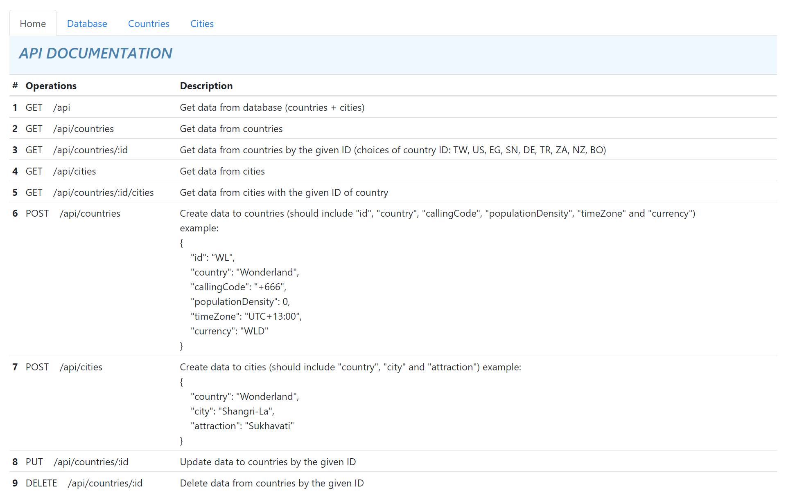
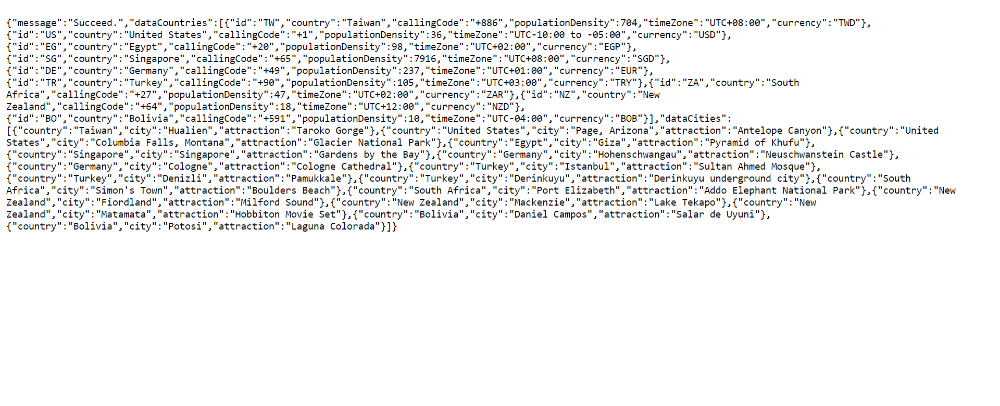
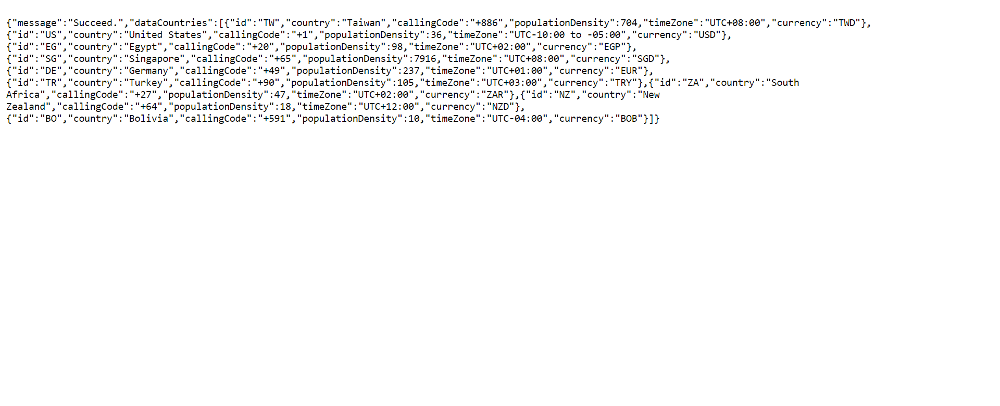
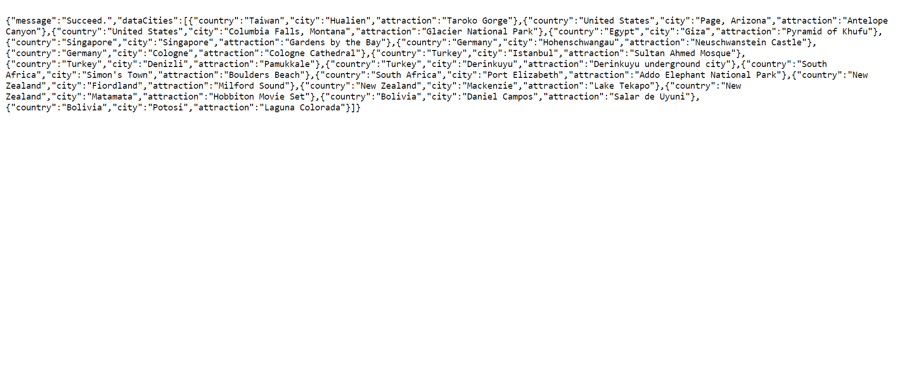

## Assignment 3 Part A - Make a RESTful API

My first quasi-RESTful API of countries and cities. Instead of connecting to a real database, it uses static JSON files as the database just to test out the functionality of the server scripts.

Tools: **_Express.js_**, **_EJS (Embedded JavaScript)_**, and **_Bootstrap_**

### Website Pages Preview:

- Home

  

- Database

  

- Countries

  

- Cities

  

---

## Assignment Instructions

This is a two-part project. In this first part you are going to take what we've been learning about RESTful APIs and create your own API using the REST architecture and Express.js.

It is up to you to decide what kind of data you want to create, read, update, and delete. **For this first part of the project, you will NOT be connecting to a database. Instead you will be faking the data by using static JSON files.**

You can create an API that models any kind of resources you want. It could be movies, recipes, jokes, the weather, anything! The API should use HTTP GET, POST, PUT, and DELETE methods for reading, creating, updating, and deleting individual resources. Your API should also provide some basic error handling for when someone visits a URL that does not exist (i.e. 404 error messages).

You will need to implement your API using Express and Glitch. Here is a good tutorial on designing REST APIs from [restfulapi.net](https://restfulapi.net/rest-api-design-tutorial-with-example/).

### Testing you API

You may find it helpful to use an API testing tool. There are many to choose from or you can use `curl` on the command line. I recommend the the [Postman](https://chrome.google.com/webstore/detail/postman/fhbjgbiflinjbdggehcddcbncdddomop?hl=en) Chrome plugin or desktop application to issue specific HTTP requests and send/receive JSON payloads.

### Steps

1. Read this tutorial on designing REST APIs from [restfulapi.net](https://restfulapi.net/rest-api-design-tutorial-with-example/).
2. **Remix** [this project to get started](https://glitch.com/~infsci2560-assignment3-template).
3. Start by writing some documentation for your API in `README.md` (you can also add HTML documentation to the `index.ejs` view as well). _Describe your API for humans_ by writing the URLs and what parameters, payloads(the JSON object you get when you make a request) and the HTTP response codes a user can expect. Be sure to include a example requests and responses for each URL endpoint. Browse your favorite web API to get inspiration on how to write good documentation. The [Darksky API documentation](https://darksky.net/dev/docs) is a good example.
4. Create JSON files to represent the resource(s) in your RESTful API. One file should contain a [JSON array](https://developer.mozilla.org/en-US/docs/Learn/JavaScript/Objects/JSON#Arrays_as_JSON) of all of the specified resources. For example, one .json file for recipes and another .json file for ingredients. You get to determine how your resources are structured in JSON.
5. Use `require` to load the JSON file(s) containing your resources. For example `const recipes = require('./recipes.json')` will load my recipes json file and save the result in a variable named recipes.
6. You should have a minimum of 6 HTTP operations which include one of: HTTP GET, POST, PUT and DELETE.
7. Create Express routes that map endpoints to handler functions that will return appropriate values or responses. For operations that modify a resource (PUT, PATCH, POST) you have a placeholder function and return an HTTP SUCCESS code. You do not need to modify your static JSON files to create persistent data (you will do this in part B).

### Expectations

- At least six endpoints for at least 2 different types of resources (e.g. `GET /student`, `POST /student`, `GET /buildings`, etc.).
  - For our purposes, an endpoint would be a URL and an HTTP method. So if you implement GET and POST methods for 3 URLS (`/student`, `/student/:id`, and `/courses`) you will have 6 endpoints.
  - This means you should have a minimum of 6 Express route functions for HTTP operations (HTTP GET, POST, PUT and DELETE)
- At least one resource should have a sub-collection (like /student/:id/courses). This also implies that you should have at least one endpoint that has path parameters.
- Document the API with the endpoints, parameters, JSON payloads and response codes.
- Proper error handling and response code when a request doesn’t conform to the API (i.e. an endpoint or resource ID that doesn't exist).
- All data will be transferred in the JSON data format.
- Populate your API with some JSON data to support your operations. For now, store the data in JSON files that are loaded into JavaScript objects in your application.
- Make an endpoint that lists all all of your resources in your "database" (JSON file). For example, "`GET /student`" would return a JSON list of all the student objects in your application and "`GET /courses`" would provide a list of all the course objects. You should have at least 6 instances of resources in your application, they can be of any types.
