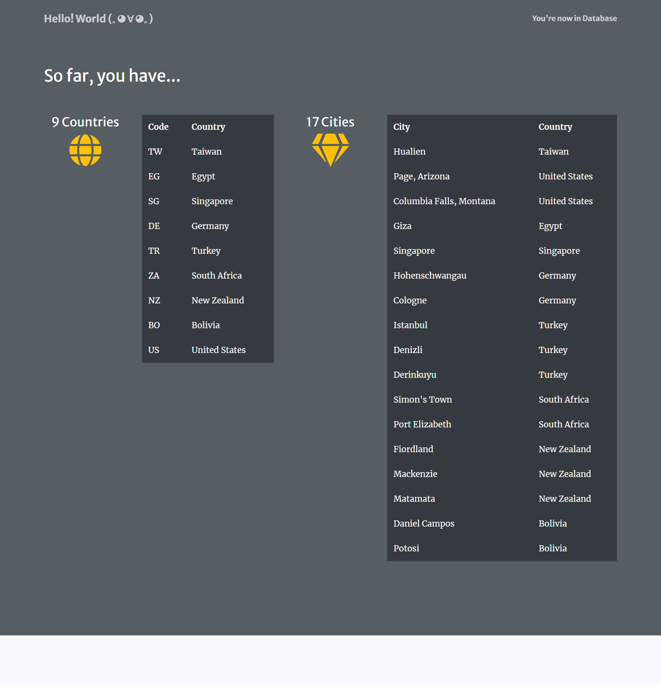
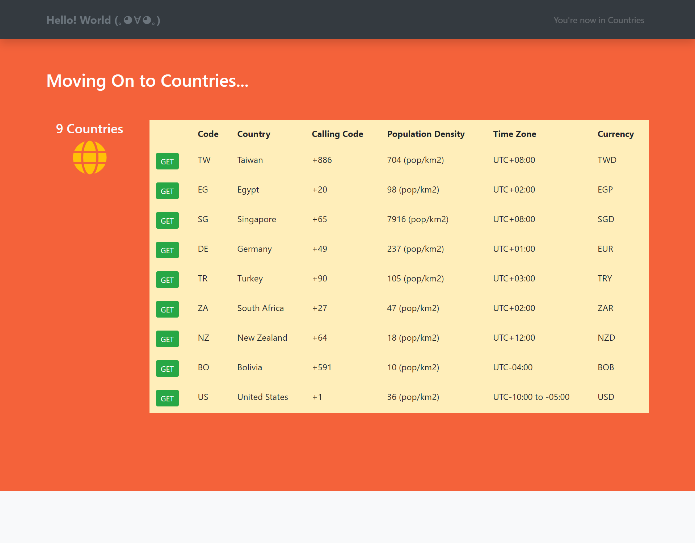
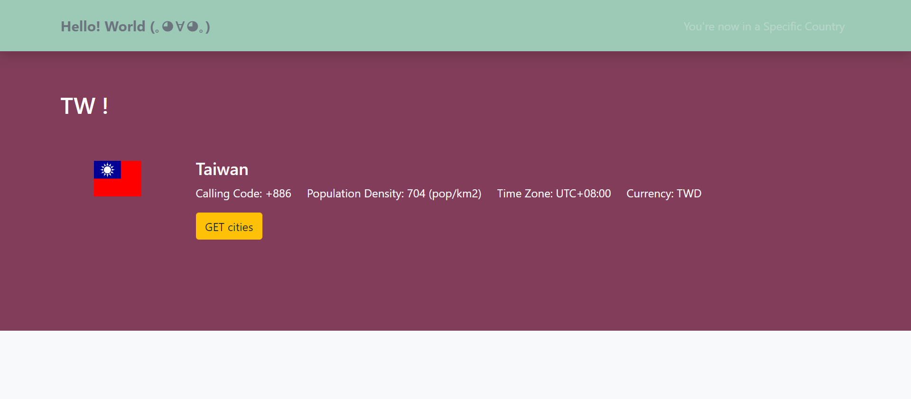
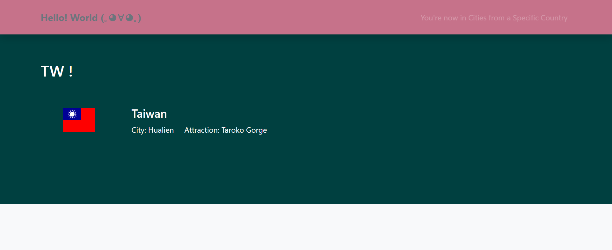
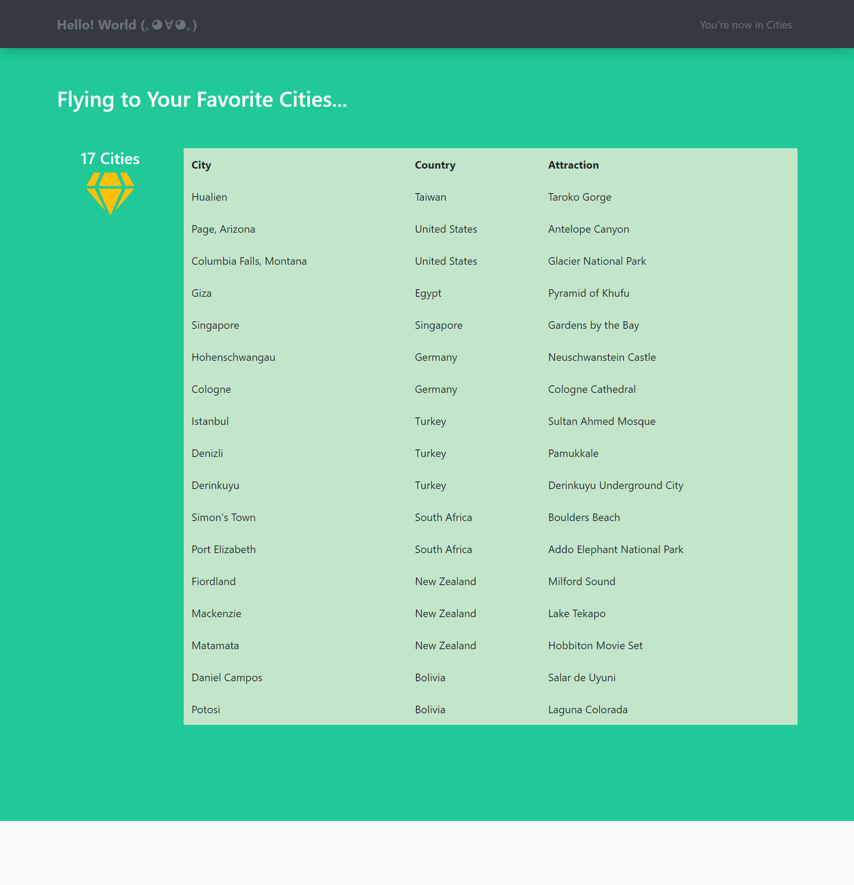
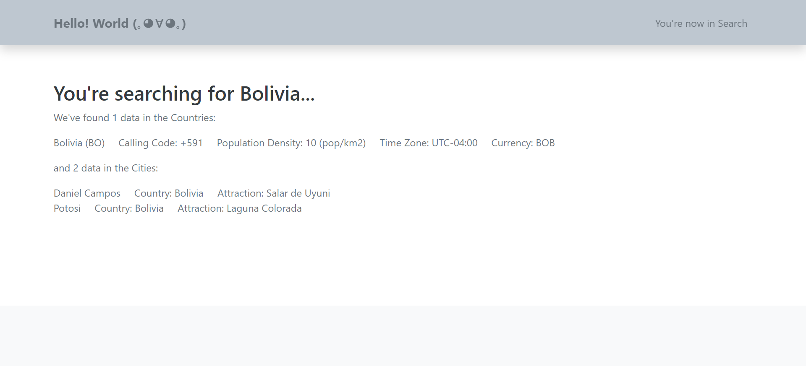

## Assignment 3 Part B - Database Your RESTful API

The final RESTful website of countries and cities, using MongoDB as its database. It is designed for people to manage their future travel destinations during COVID-19 quarantine.

Tools: **_Express.js_**, **_EJS (Embedded JavaScript)_**, **_Bootstrap_**, and **_MongoDB Atlas_**

_P.S. I don't own any photos of this website. They are resources from the Internet._

# View Here -> [https://infsci2560-a3b-helloworld.herokuapp.com/](https://infsci2560-a3b-helloworld.herokuapp.com/)

### Website Pages Preview:

- API Doc Overview

  

- Database

  

- Countries

  

  

  

- Cities

  

- Query

  

### Documentation

_Please see the homepage (index) for visualized documentation_

**Data Models**

Countries

```json
{
  "code": String,
  "country": String,
  "callingCode": String,
  "populationDensity": Number,
  "timeZone": String,
  "currency": String
}
```

Cities

```json
{
  "country": String,
  "city": String,
  "attraction": String
}
```

**Endpoints**

- GET /api
  - Read data from database
  - Expected response: 200 OK, returns a web page showing the lists of data in Countries and Cities
- GET /api/countries
  - Read data from countries
  - Expected response: 200 OK, returns a web page showing the list of data in Countries
- GET /api/countries/:code
  - Read data from countries by the given country ISO code
  - Expected response: 200 OK, returns a web page showing details of the given country
- GET /api/countries/:code/cities
  - Read data from cities with the given country ISO code
  - Expected response: 200 OK, returns a web page showing details of the city by the given country ISO code.
- GET /api/cities
  - Read data from cities
  - Expected response: 200 OK, returns a web page showing the list of data in Cities.
- POST /api/countries
  - Create data to countries
  - Expected response: 200 OK, returns a json format showing the created data of a country. And if you refresh the /api/countries web page, the new data will also be shown in the list.
- POST /api/cities
  - Create data to cities
  - Expected response: 200 OK, returns a json format showing the created data of a city. And if you refresh the /api/cities web page, the new data will also be shown in the list.
- PUT /api/countries/:code
  - Update data to countries by the given country ISO code
  - Expected response: 200 OK, returns a json format showing the updated data of a country. And if you refresh the /api/countries web page, the new data will also be shown in the list.
- DELETE /api/countries/:code
  - Delete data from countries by the given country ISO code
  - Expected response: 200 OK, returns a json format showing the deleted data of a country. And if you refresh the /api/countries web page, that data will be removed in the list.
- GET /api/search?query=name
  - Read data from the database by the given query name
  - Expected response: 200 OK, returns a web page showing list(s) of data found.

---

## Assignment Instructions

This is a two-part project. In this first part of this project you designed your own RESTful API that uses the REST architecture using Express.js. In the second part of this project, we are going to replace the static .json file database with a database.

**I strongly recommend that you REMIX Project 3a to get started for this part.** Again, it is up to you to decide what kind of data you want to create, read, update, and delete.

You will need to implement your API using Express and Glitch. Here is a good tutorial on designing REST APIs from [restfulapi.net](https://restfulapi.net/rest-api-design-tutorial-with-example/). I expect for you to follow the principles and approach described in this tutorial. Specifically on _Create Model URIs_.

### Testing you API

You may find it helpful to use an API testing tool. There are many to choose from or you can use `curl` on the command line. I recommend the the [Postman](https://chrome.google.com/webstore/detail/postman/fhbjgbiflinjbdggehcddcbncdddomop?hl=en) desktop application to issue specific HTTP requests and send/receive JSON payloads.

### Steps

1. Create a database for this project in your MongoDB instance. (Assuming you completed Activity 9, to setup MongoDB)
2. Connect your project to the MongoDB database you created in Activity 9. Make sure to add mongoose to your list of dependencies in the `package.json` file. The dependencies section should now look like: `"dependencies": { "express": "^4.16.4", "mongoose": "^5.7.7", "ejs": "^2.7.1" },`
3. Create a schema using Mongoose that models the different mounts and their properties. For example, if you are modeling students taking courses at a university you might have a data model for students and another data model for classes. Students would have various properties like name, degree program, year in the program, and a list of connections to classes. Classes would have titles, meeting times, instructors, etc.
4. Update your CREATE/GET operation to query your MongoDB, using Mongoose.
5. Use Mongoose to implement the Create, Update and Delete operations. See the [Mongoose documentation](https://mongoosejs.com/docs/api.html#Model) for a complete list of methods & operations available.
6. In addition to the 6 HTTP operations which include one of: HTTP GET, POST, PUT and DELETE (from part A) -- you should implement ONE more advanced operation of your choice, such as: delete many, insert many, update many, retrieve a list of items with filter options, etc. Anything beyond the basic single CRUD operations will suffice here. (e.g GET /id, DELETE /id) If you have questions, ASK.
7. Make sure your Express routes that map endpoints to handler functions return appropriate values or responses. For operations that modify a resource (PUT, PATCH, POST) you should provide proper error handling and return an HTTP SUCCESS or ERROR code. These operations should correctly create or update your resources in the database.
8. You should also have your two templates from part A, using EJS to display the results of your operations. Since we are using EJS, you are expected to pass & display variables. E.g. On a GET request, nicely format and display the data returned (e.g. course title and description).
9. Map and render the response for each HTTP operation to an appropriate view template. (e.g. the view template for a student will be different for a view template for a course.)

### Expectations

- Same expectations as part A. In other words, if there is something you omitted or did incorrectly, this is your opportunity to redo it for credit.
- At least six endpoints for at least 2 different resources (e.g. `GET /student`, `POST /student`, `GET /buildings`).
  - For our purposes, an endpoint would be a URL and an HTTP method. So if you implement GET and POST methods for 3 URLS (/student, /student/:id, and /courses) you will have 6 endpoints.
  - This means you should have a minimum of 6 Express route functions for HTTP operations (HTTP GET, POST, PUT and DELETE)
- At least one should have a sub-collection (like `/student/:id/courses`). This also implies that you should have at least one endpoint that has path parameters.
- Document the API with the endpoints, parameters, payloads and response codes in the README.md.
- Proper error handling and response code when a request doesn’t conform to the API.
- All data will be transferred in the JSON data format.
- Populate your MongoDB with some data to support your operations, on initialization. In other words, when I go to your app, there should already be data to "play around with."
- Make an endpoint that lists all all of your resources in your "database" (JSON file). For example, "`GET /student`" would return a JSON list of all the student objects in your application and "`GET /courses`" would provide a list of all the course objects. You should have at least 6 instances of resources in your application, they can be of any types.
